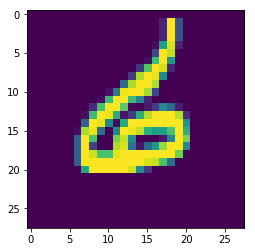
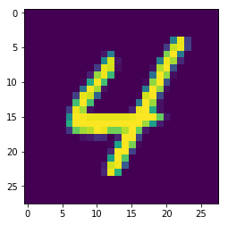

# Digit Recognizer

Kagggle link: https://www.kaggle.com/c/digit-recognizer


## Prepare Environment


```python
import numpy as np
import pandas as pd
import tensorflow as tf
import math
import matplotlib.pyplot as plt
%matplotlib inline
```

## Prepare Data


```python
all_train_data = pd.read_csv("all/train.csv")
```


```python
# seperate train and cross from train data
train_frac = 0.9
train_data = all_train_data.sample(frac=train_frac, random_state=300)
cross_data = all_train_data.drop(train_data.index)
```


```python
# split label and pixel
y_train = train_data['label']
X_train = train_data.drop(labels = ["label"], axis = 1) 
y_cross = cross_data['label']
X_cross = cross_data.drop(labels = ["label"], axis = 1) 
```


```python
# normalize
X_train = X_train / 255
X_cross = X_cross / 255
```


```python
# pandas to numpy array
X_train = X_train.values.reshape(-1, 28, 28, 1)
X_cross = X_cross.values.reshape(-1, 28, 28, 1)

y_train = y_train.values
y_cross = y_cross.values
```

### Show one of example


```python
plt.imshow(X_train[5][:, :, 0])
```


    <matplotlib.image.AxesImage at 0xb1827c668>





## Build Model


```python
def model(X, is_training):
    w_initializer = tf.variance_scaling_initializer()
    b_initializer = tf.zeros_initializer()
   
    # Convolutional Layer #1 and Pooling Layer #1
    conv1 = tf.layers.conv2d(
        inputs=X,
        filters=32,
        kernel_size=[3, 3],
        padding="valid",
        kernel_initializer=w_initializer,
        bias_initializer=b_initializer,
        activation=tf.nn.relu)

    pool1 = tf.layers.max_pooling2d(inputs=conv1, pool_size=[2, 2], strides=2)

    # Convolutional Layer #2 and Pooling Layer #2
    conv2 = tf.layers.conv2d(
        inputs=pool1,
        filters=64,
        kernel_size=[3, 3],
        padding="valid",
        kernel_initializer=w_initializer,
        bias_initializer=b_initializer,
        activation=tf.nn.relu)

    pool2 = tf.layers.max_pooling2d(inputs=conv2, pool_size=[2, 2], strides=2)

    # Dense Layer
    pool2_flat = tf.reshape(pool2, [-1, 5 * 5 * 64])
    dense = tf.layers.dense(
        inputs=pool2_flat, 
        units=128, 
        activation=tf.nn.relu,
        kernel_initializer=w_initializer,
        bias_initializer=b_initializer
    )
    dropout = tf.layers.dropout(inputs=dense, rate=0.6, training=is_training)

    # Logits Layer
    logits = tf.layers.dense(inputs=dropout, units=10)
    
    return logits
```


```python
# to see dimension for each layer
tf.reset_default_graph()
X = tf.placeholder(tf.float32, [None, 28, 28, 1])
y = tf.placeholder(tf.int32, [None])

# midel pipe
prediction = model(X, is_training=True)
print(str(tf.contrib.graph_editor.get_tensors(tf.get_default_graph())).replace('<', '\n<'))
    
```

    [
    <tf.Tensor 'Placeholder:0' shape=(?, 28, 28, 1) dtype=float32>, 
    <tf.Tensor 'Placeholder_1:0' shape=(?,) dtype=int32>, 
    <tf.Tensor 'conv2d/kernel/Initializer/truncated_normal/shape:0' shape=(4,) dtype=int32>, 
    <tf.Tensor 'conv2d/kernel/Initializer/truncated_normal/mean:0' shape=() dtype=float32>, 
    <tf.Tensor 'conv2d/kernel/Initializer/truncated_normal/stddev:0' shape=() dtype=float32>, 
    <tf.Tensor 'conv2d/kernel/Initializer/truncated_normal/TruncatedNormal:0' shape=(3, 3, 1, 32) dtype=float32>, 
    <tf.Tensor 'conv2d/kernel/Initializer/truncated_normal/mul:0' shape=(3, 3, 1, 32) dtype=float32>, 
    <tf.Tensor 'conv2d/kernel/Initializer/truncated_normal:0' shape=(3, 3, 1, 32) dtype=float32>, 
    <tf.Tensor 'conv2d/kernel:0' shape=(3, 3, 1, 32) dtype=float32_ref>, 
    <tf.Tensor 'conv2d/kernel/Assign:0' shape=(3, 3, 1, 32) dtype=float32_ref>, 
    <tf.Tensor 'conv2d/kernel/read:0' shape=(3, 3, 1, 32) dtype=float32>, 
    <tf.Tensor 'conv2d/bias/Initializer/zeros:0' shape=(32,) dtype=float32>, 
    <tf.Tensor 'conv2d/bias:0' shape=(32,) dtype=float32_ref>, 
    <tf.Tensor 'conv2d/bias/Assign:0' shape=(32,) dtype=float32_ref>, 
    <tf.Tensor 'conv2d/bias/read:0' shape=(32,) dtype=float32>, 
    <tf.Tensor 'conv2d/dilation_rate:0' shape=(2,) dtype=int32>, 
    <tf.Tensor 'conv2d/Conv2D:0' shape=(?, 26, 26, 32) dtype=float32>, 
    <tf.Tensor 'conv2d/BiasAdd:0' shape=(?, 26, 26, 32) dtype=float32>, 
    <tf.Tensor 'conv2d/Relu:0' shape=(?, 26, 26, 32) dtype=float32>, 
    <tf.Tensor 'max_pooling2d/MaxPool:0' shape=(?, 13, 13, 32) dtype=float32>, 
    <tf.Tensor 'conv2d_1/kernel/Initializer/truncated_normal/shape:0' shape=(4,) dtype=int32>, 
    <tf.Tensor 'conv2d_1/kernel/Initializer/truncated_normal/mean:0' shape=() dtype=float32>, 
    <tf.Tensor 'conv2d_1/kernel/Initializer/truncated_normal/stddev:0' shape=() dtype=float32>, 
    <tf.Tensor 'conv2d_1/kernel/Initializer/truncated_normal/TruncatedNormal:0' shape=(3, 3, 32, 64) dtype=float32>, 
    <tf.Tensor 'conv2d_1/kernel/Initializer/truncated_normal/mul:0' shape=(3, 3, 32, 64) dtype=float32>, 
    <tf.Tensor 'conv2d_1/kernel/Initializer/truncated_normal:0' shape=(3, 3, 32, 64) dtype=float32>, 
    <tf.Tensor 'conv2d_1/kernel:0' shape=(3, 3, 32, 64) dtype=float32_ref>, 
    <tf.Tensor 'conv2d_1/kernel/Assign:0' shape=(3, 3, 32, 64) dtype=float32_ref>, 
    <tf.Tensor 'conv2d_1/kernel/read:0' shape=(3, 3, 32, 64) dtype=float32>, 
    <tf.Tensor 'conv2d_1/bias/Initializer/zeros:0' shape=(64,) dtype=float32>, 
    <tf.Tensor 'conv2d_1/bias:0' shape=(64,) dtype=float32_ref>, 
    <tf.Tensor 'conv2d_1/bias/Assign:0' shape=(64,) dtype=float32_ref>, 
    <tf.Tensor 'conv2d_1/bias/read:0' shape=(64,) dtype=float32>, 
    <tf.Tensor 'conv2d_1/dilation_rate:0' shape=(2,) dtype=int32>, 
    <tf.Tensor 'conv2d_1/Conv2D:0' shape=(?, 11, 11, 64) dtype=float32>, 
    <tf.Tensor 'conv2d_1/BiasAdd:0' shape=(?, 11, 11, 64) dtype=float32>, 
    <tf.Tensor 'conv2d_1/Relu:0' shape=(?, 11, 11, 64) dtype=float32>, 
    <tf.Tensor 'max_pooling2d_1/MaxPool:0' shape=(?, 5, 5, 64) dtype=float32>, 
    <tf.Tensor 'Reshape/shape:0' shape=(2,) dtype=int32>, 
    <tf.Tensor 'Reshape:0' shape=(?, 1600) dtype=float32>, 
    <tf.Tensor 'dense/kernel/Initializer/truncated_normal/shape:0' shape=(2,) dtype=int32>, 
    <tf.Tensor 'dense/kernel/Initializer/truncated_normal/mean:0' shape=() dtype=float32>, 
    <tf.Tensor 'dense/kernel/Initializer/truncated_normal/stddev:0' shape=() dtype=float32>, 
    <tf.Tensor 'dense/kernel/Initializer/truncated_normal/TruncatedNormal:0' shape=(1600, 128) dtype=float32>, 
    <tf.Tensor 'dense/kernel/Initializer/truncated_normal/mul:0' shape=(1600, 128) dtype=float32>, 
    <tf.Tensor 'dense/kernel/Initializer/truncated_normal:0' shape=(1600, 128) dtype=float32>, 
    <tf.Tensor 'dense/kernel:0' shape=(1600, 128) dtype=float32_ref>, 
    <tf.Tensor 'dense/kernel/Assign:0' shape=(1600, 128) dtype=float32_ref>, 
    <tf.Tensor 'dense/kernel/read:0' shape=(1600, 128) dtype=float32>, 
    <tf.Tensor 'dense/bias/Initializer/zeros:0' shape=(128,) dtype=float32>, 
    <tf.Tensor 'dense/bias:0' shape=(128,) dtype=float32_ref>, 
    <tf.Tensor 'dense/bias/Assign:0' shape=(128,) dtype=float32_ref>, 
    <tf.Tensor 'dense/bias/read:0' shape=(128,) dtype=float32>, 
    <tf.Tensor 'dense/MatMul:0' shape=(?, 128) dtype=float32>, 
    <tf.Tensor 'dense/BiasAdd:0' shape=(?, 128) dtype=float32>, 
    <tf.Tensor 'dense/Relu:0' shape=(?, 128) dtype=float32>, 
    <tf.Tensor 'dropout/dropout/keep_prob:0' shape=() dtype=float32>, 
    <tf.Tensor 'dropout/dropout/Shape:0' shape=(2,) dtype=int32>, 
    <tf.Tensor 'dropout/dropout/random_uniform/min:0' shape=() dtype=float32>, 
    <tf.Tensor 'dropout/dropout/random_uniform/max:0' shape=() dtype=float32>, 
    <tf.Tensor 'dropout/dropout/random_uniform/RandomUniform:0' shape=(?, 128) dtype=float32>, 
    <tf.Tensor 'dropout/dropout/random_uniform/sub:0' shape=() dtype=float32>, 
    <tf.Tensor 'dropout/dropout/random_uniform/mul:0' shape=(?, 128) dtype=float32>, 
    <tf.Tensor 'dropout/dropout/random_uniform:0' shape=(?, 128) dtype=float32>, 
    <tf.Tensor 'dropout/dropout/add:0' shape=(?, 128) dtype=float32>, 
    <tf.Tensor 'dropout/dropout/Floor:0' shape=(?, 128) dtype=float32>, 
    <tf.Tensor 'dropout/dropout/div:0' shape=(?, 128) dtype=float32>, 
    <tf.Tensor 'dropout/dropout/mul:0' shape=(?, 128) dtype=float32>, 
    <tf.Tensor 'dense_1/kernel/Initializer/random_uniform/shape:0' shape=(2,) dtype=int32>, 
    <tf.Tensor 'dense_1/kernel/Initializer/random_uniform/min:0' shape=() dtype=float32>, 
    <tf.Tensor 'dense_1/kernel/Initializer/random_uniform/max:0' shape=() dtype=float32>, 
    <tf.Tensor 'dense_1/kernel/Initializer/random_uniform/RandomUniform:0' shape=(128, 10) dtype=float32>, 
    <tf.Tensor 'dense_1/kernel/Initializer/random_uniform/sub:0' shape=() dtype=float32>, 
    <tf.Tensor 'dense_1/kernel/Initializer/random_uniform/mul:0' shape=(128, 10) dtype=float32>, 
    <tf.Tensor 'dense_1/kernel/Initializer/random_uniform:0' shape=(128, 10) dtype=float32>, 
    <tf.Tensor 'dense_1/kernel:0' shape=(128, 10) dtype=float32_ref>, 
    <tf.Tensor 'dense_1/kernel/Assign:0' shape=(128, 10) dtype=float32_ref>, 
    <tf.Tensor 'dense_1/kernel/read:0' shape=(128, 10) dtype=float32>, 
    <tf.Tensor 'dense_1/bias/Initializer/zeros:0' shape=(10,) dtype=float32>, 
    <tf.Tensor 'dense_1/bias:0' shape=(10,) dtype=float32_ref>, 
    <tf.Tensor 'dense_1/bias/Assign:0' shape=(10,) dtype=float32_ref>, 
    <tf.Tensor 'dense_1/bias/read:0' shape=(10,) dtype=float32>, 
    <tf.Tensor 'dense_1/MatMul:0' shape=(?, 10) dtype=float32>, 
    <tf.Tensor 'dense_1/BiasAdd:0' shape=(?, 10) dtype=float32>]


## Build Train Process


```python
def train(X_train, y_train, X_cross, y_cross, learning_rate, batch_size, epochs_num):
    train_data_num, _, _, _ = X_train.shape
    
    tf.reset_default_graph()
    
    X = tf.placeholder('float', [None, 28, 28, 1])
    y = tf.placeholder(tf.int32, [None])
    
    # model pipe
    prediction = model(X, is_training=True)
    
    # train pipe
    cost = tf.reduce_mean(tf.nn.sparse_softmax_cross_entropy_with_logits(logits = prediction, labels = y))
    optimizer = tf.train.AdamOptimizer(learning_rate=learning_rate).minimize(cost)
    
    # cross validation pipe
    correct = tf.equal(tf.argmax(prediction, 1, output_type=tf.int32), y)
    accuracy = tf.reduce_mean(tf.cast(correct, 'float'))
    
    saver = tf.train.Saver()
    sess = tf.Session()
    sess.run(tf.global_variables_initializer())
    
    for epoch in range(epochs_num):
        # shuffle data
        index = np.random.permutation(train_data_num)
        X_train=X_train[index]
        y_train=y_train[index]
        
        epoch_loss = 0
        for k in range(math.floor(train_data_num/batch_size)):
            mini_batch_X = X_train[k * batch_size : k * batch_size + batch_size]
            mini_batch_Y = y_train[k * batch_size : k * batch_size + batch_size]
            
            _, tc = sess.run([optimizer, cost], feed_dict={X: mini_batch_X, y: mini_batch_Y})
            epoch_loss += tc

        train_ac = sess.run(accuracy, feed_dict={X: X_train, y: y_train})
        cross_ac, cross_loss = sess.run([accuracy, cost], feed_dict={X:X_cross, y:y_cross})
        
        train_ac = train_ac*100
        cross_ac = cross_ac*100
        print('Epoch ', epoch+1 , ' / ', epochs_num, ': ')
        print('- Train loss: ', epoch_loss, ', Train ac: ', train_ac)
        print('- Cross loss: ', cross_loss, ', Cross ac: ', cross_ac)

    saver.save(sess, 'ckpt/digit_recog.ckpt')
    sess.close()
    
    return epoch_loss, train_ac, cross_loss, cross_ac
```

## Choose hyperparameter 

### 1. choose learning  rate


```python
learning_rate = [0.001, 0.01, 0.1]
batch_size = 128
epochs_num = 10

max_cross_ac = 0
best_lr = learning_rate[0]
for lr in learning_rate:
    print('--- lr: ', lr, '---')
    train_loss, train_ac, cross_loss, cross_ac = train(X_train, y_train, X_cross, y_cross, 
                                                       lr, batch_size, epochs_num)
    if cross_ac > max_cross_ac:
        max_cross_ac = cross_ac
        best_lr = lr

print("\nBest learning rate: ", best_lr, ' with cross accuracy:', max_cross_ac)
```

    --- lr:  0.001 ---
    Epoch  1  /  10 : 
    - Train loss:  118.28529321402311 , Train ac:  95.28042078018188
    - Cross loss:  0.1679758 , Cross ac:  94.97619271278381
    Epoch  2  /  10 : 
    - Train loss:  41.300268441438675 , Train ac:  96.56878113746643
    - Cross loss:  0.1160628 , Cross ac:  96.69047594070435
    Epoch  3  /  10 : 
    - Train loss:  30.919281600043178 , Train ac:  97.37301468849182
    - Cross loss:  0.09012888 , Cross ac:  97.47619032859802
    Epoch  4  /  10 : 
    - Train loss:  25.093676397576928 , Train ac:  97.89153337478638
    - Cross loss:  0.08245915 , Cross ac:  97.69047498703003
    Epoch  5  /  10 : 
    - Train loss:  21.289368056692183 , Train ac:  98.26455116271973
    - Cross loss:  0.07003832 , Cross ac:  97.83333539962769
    Epoch  6  /  10 : 
    - Train loss:  17.92128860903904 , Train ac:  98.25661182403564
    - Cross loss:  0.07498747 , Cross ac:  97.97618985176086
    Epoch  7  /  10 : 
    - Train loss:  16.651686898432672 , Train ac:  98.48941564559937
    - Cross loss:  0.0703983 , Cross ac:  97.97618985176086
    Epoch  8  /  10 : 
    - Train loss:  15.390481860376894 , Train ac:  98.57142567634583
    - Cross loss:  0.0671482 , Cross ac:  98.11905026435852
    Epoch  9  /  10 : 
    - Train loss:  13.492744039278477 , Train ac:  98.72486591339111
    - Cross loss:  0.061812934 , Cross ac:  98.30952286720276
    Epoch  10  /  10 : 
    - Train loss:  12.444050639402121 , Train ac:  98.91534447669983
    - Cross loss:  0.061648704 , Cross ac:  98.04762005805969
    --- lr:  0.01 ---
    Epoch  1  /  10 : 
    - Train loss:  111.49762486666441 , Train ac:  94.0317451953888
    - Cross loss:  0.19756241 , Cross ac:  93.92856955528259
    Epoch  2  /  10 : 
    - Train loss:  52.675561279058456 , Train ac:  95.43121457099915
    - Cross loss:  0.14696202 , Cross ac:  95.52381038665771
    Epoch  3  /  10 : 
    - Train loss:  46.07343294844031 , Train ac:  96.29100561141968
    - Cross loss:  0.13912903 , Cross ac:  95.6666648387909
    Epoch  4  /  10 : 
    - Train loss:  44.195682153105736 , Train ac:  94.99471187591553
    - Cross loss:  0.16730186 , Cross ac:  94.42856907844543
    Epoch  5  /  10 : 
    - Train loss:  39.85612620972097 , Train ac:  96.20370268821716
    - Cross loss:  0.13680096 , Cross ac:  95.71428298950195
    Epoch  6  /  10 : 
    - Train loss:  39.496556516736746 , Train ac:  96.84656262397766
    - Cross loss:  0.12264448 , Cross ac:  96.40476107597351
    Epoch  7  /  10 : 
    - Train loss:  37.72891751024872 , Train ac:  96.3518500328064
    - Cross loss:  0.14236651 , Cross ac:  95.90476155281067
    Epoch  8  /  10 : 
    - Train loss:  37.5163579005748 , Train ac:  96.85449600219727
    - Cross loss:  0.1391378 , Cross ac:  96.1904764175415
    Epoch  9  /  10 : 
    - Train loss:  34.91127104498446 , Train ac:  96.875661611557
    - Cross loss:  0.13211346 , Cross ac:  96.04762196540833
    Epoch  10  /  10 : 
    - Train loss:  35.243180675432086 , Train ac:  96.49999737739563
    - Cross loss:  0.13698426 , Cross ac:  95.76190710067749
    --- lr:  0.1 ---
    Epoch  1  /  10 : 
    - Train loss:  1021.3632190227509 , Train ac:  11.179894208908081
    - Cross loss:  2.3082972 , Cross ac:  10.904762148857117
    Epoch  2  /  10 : 
    - Train loss:  680.5298998355865 , Train ac:  11.179894208908081
    - Cross loss:  2.3055084 , Cross ac:  10.904762148857117
    Epoch  3  /  10 : 
    - Train loss:  680.9053506851196 , Train ac:  10.343915224075317
    - Cross loss:  2.3029373 , Cross ac:  10.499999672174454
    Epoch  4  /  10 : 
    - Train loss:  680.6595709323883 , Train ac:  11.179894208908081
    - Cross loss:  2.3113704 , Cross ac:  10.904762148857117
    Epoch  5  /  10 : 
    - Train loss:  680.5725591182709 , Train ac:  11.179894208908081
    - Cross loss:  2.3078213 , Cross ac:  10.904762148857117
    Epoch  6  /  10 : 
    - Train loss:  680.4706645011902 , Train ac:  10.544973611831665
    - Cross loss:  2.309896 , Cross ac:  9.880952537059784
    Epoch  7  /  10 : 
    - Train loss:  680.8093347549438 , Train ac:  10.343915224075317
    - Cross loss:  2.3109007 , Cross ac:  10.499999672174454
    Epoch  8  /  10 : 
    - Train loss:  680.502277135849 , Train ac:  9.695766866207123
    - Cross loss:  2.3094182 , Cross ac:  9.690476208925247
    Epoch  9  /  10 : 
    - Train loss:  680.4887573719025 , Train ac:  10.544973611831665
    - Cross loss:  2.306762 , Cross ac:  9.880952537059784
    Epoch  10  /  10 : 
    - Train loss:  680.7472629547119 , Train ac:  11.179894208908081
    - Cross loss:  2.313099 , Cross ac:  10.904762148857117
    
    Best learning rate:  0.001  with cross accuracy: 98.04762005805969


You can see the best learning rate for cross loss is **0.001** with cross accuracy: 98.04762005805969

### 2. choose batch size


```python
# change batch size
learning_rate = 0.001
batch_size_list = [64, 128, 256]
epochs_num = 10

max_cross_ac = 0
best_bs = batch_size_list[0]
for bs in batch_size_list:
    print('--- batch size: ', bs, ' ---')
    train_loss, train_ac, cross_loss, cross_ac = train(X_train, y_train, X_cross, y_cross, 
                                                       learning_rate, bs, epochs_num)
    if cross_ac > max_cross_ac:
        max_cross_ac = cross_ac
        best_bs = bs

print("\nBest batch size: ", best_bs, ', with cross accuracy:', max_cross_ac)
```

    --- batch size:  64  ---
    Epoch  1  /  10 : 
    - Train loss:  195.9907901994884 , Train ac:  95.96296548843384
    - Cross loss:  0.13417675 , Cross ac:  95.92857360839844
    Epoch  2  /  10 : 
    - Train loss:  70.02418467402458 , Train ac:  97.36508131027222
    - Cross loss:  0.09691779 , Cross ac:  97.09523916244507
    Epoch  3  /  10 : 
    - Train loss:  51.47557849064469 , Train ac:  97.8518545627594
    - Cross loss:  0.07777838 , Cross ac:  97.42857217788696
    Epoch  4  /  10 : 
    - Train loss:  42.16823971341364 , Train ac:  97.76190519332886
    - Cross loss:  0.08799585 , Cross ac:  97.57142663002014
    Epoch  5  /  10 : 
    - Train loss:  36.65191896818578 , Train ac:  98.38888645172119
    - Cross loss:  0.07146958 , Cross ac:  98.00000190734863
    Epoch  6  /  10 : 
    - Train loss:  31.816332316957414 , Train ac:  98.70370626449585
    - Cross loss:  0.067367174 , Cross ac:  98.04762005805969
    Epoch  7  /  10 : 
    - Train loss:  26.522872751695104 , Train ac:  98.68518710136414
    - Cross loss:  0.0642966 , Cross ac:  98.35714101791382
    Epoch  8  /  10 : 
    - Train loss:  24.367731804493815 , Train ac:  98.95238280296326
    - Cross loss:  0.05125171 , Cross ac:  98.64285588264465
    Epoch  9  /  10 : 
    - Train loss:  22.93704123736825 , Train ac:  99.015873670578
    - Cross loss:  0.05830011 , Cross ac:  98.40475916862488
    Epoch  10  /  10 : 
    - Train loss:  19.044197759474628 , Train ac:  98.92857074737549
    - Cross loss:  0.060153216 , Cross ac:  98.33333492279053
    --- batch size:  128  ---
    Epoch  1  /  10 : 
    - Train loss:  113.62791318446398 , Train ac:  95.1375663280487
    - Cross loss:  0.1693085 , Cross ac:  95.02381086349487
    Epoch  2  /  10 : 
    - Train loss:  40.012725822627544 , Train ac:  96.75132036209106
    - Cross loss:  0.10997273 , Cross ac:  96.92857265472412
    Epoch  3  /  10 : 
    - Train loss:  30.704777332022786 , Train ac:  97.28307127952576
    - Cross loss:  0.100325994 , Cross ac:  97.02380895614624
    Epoch  4  /  10 : 
    - Train loss:  26.172820573672652 , Train ac:  97.7830708026886
    - Cross loss:  0.08391715 , Cross ac:  97.3809540271759
    Epoch  5  /  10 : 
    - Train loss:  21.149837653152645 , Train ac:  98.15608263015747
    - Cross loss:  0.07485786 , Cross ac:  97.35714197158813
    Epoch  6  /  10 : 
    - Train loss:  18.26911415765062 , Train ac:  98.12169075012207
    - Cross loss:  0.071513146 , Cross ac:  97.97618985176086
    Epoch  7  /  10 : 
    - Train loss:  16.931448807474226 , Train ac:  98.67724776268005
    - Cross loss:  0.07287616 , Cross ac:  98.11905026435852
    Epoch  8  /  10 : 
    - Train loss:  14.733151971362531 , Train ac:  98.46296310424805
    - Cross loss:  0.06739555 , Cross ac:  98.16666841506958
    Epoch  9  /  10 : 
    - Train loss:  13.502546024974436 , Train ac:  98.65344166755676
    - Cross loss:  0.06868779 , Cross ac:  98.2619047164917
    Epoch  10  /  10 : 
    - Train loss:  11.80103446985595 , Train ac:  98.9047646522522
    - Cross loss:  0.05543737 , Cross ac:  98.33333492279053
    --- batch size:  256  ---
    Epoch  1  /  10 : 
    - Train loss:  68.7681735754013 , Train ac:  94.38889026641846
    - Cross loss:  0.17940593 , Cross ac:  94.73809599876404
    Epoch  2  /  10 : 
    - Train loss:  23.1994973346591 , Train ac:  95.8042323589325
    - Cross loss:  0.13897519 , Cross ac:  95.76190710067749
    Epoch  3  /  10 : 
    - Train loss:  17.168953485786915 , Train ac:  97.0714271068573
    - Cross loss:  0.10830586 , Cross ac:  96.7380940914154
    Epoch  4  /  10 : 
    - Train loss:  13.947271544486284 , Train ac:  97.51058220863342
    - Cross loss:  0.08992298 , Cross ac:  97.69047498703003
    Epoch  5  /  10 : 
    - Train loss:  12.287227535620332 , Train ac:  97.64285683631897
    - Cross loss:  0.081738696 , Cross ac:  97.6190447807312
    Epoch  6  /  10 : 
    - Train loss:  10.864492448046803 , Train ac:  98.2195794582367
    - Cross loss:  0.071571924 , Cross ac:  98.00000190734863
    Epoch  7  /  10 : 
    - Train loss:  9.338103061541915 , Train ac:  97.92592525482178
    - Cross loss:  0.09036051 , Cross ac:  97.57142663002014
    Epoch  8  /  10 : 
    - Train loss:  8.855301681905985 , Train ac:  98.3650803565979
    - Cross loss:  0.06484823 , Cross ac:  98.02380800247192
    Epoch  9  /  10 : 
    - Train loss:  7.792829042300582 , Train ac:  98.58730435371399
    - Cross loss:  0.0679669 , Cross ac:  98.19047451019287
    Epoch  10  /  10 : 
    - Train loss:  7.278593134135008 , Train ac:  98.69047403335571
    - Cross loss:  0.06733117 , Cross ac:  98.21428656578064
    
    Best batch size:  64 , with cross accuracy: 98.33333492279053


You can see the best batch size for cross loss is **64** with cross accuracy: 98.33333492279053

(The batch size 128 is also ok with the same cross accuracy)

### 3. choose epoch num


```python
learning_rate = 0.001
batch_size_list = 128
epochs_num = 20

train_loss, train_ac, cross_loss, cross_ac = train(X_train, y_train, X_cross, y_cross, 
                                                   learning_rate, bs, epochs_num)

print('\nCross accuracy:', cross_ac)

```

    Epoch  1  /  20 : 
    - Train loss:  71.58859105408192 , Train ac:  94.27777528762817
    - Cross loss:  0.1959934 , Cross ac:  93.92856955528259
    Epoch  2  /  20 : 
    - Train loss:  22.98341851681471 , Train ac:  96.32539749145508
    - Cross loss:  0.13656352 , Cross ac:  96.21428847312927
    Epoch  3  /  20 : 
    - Train loss:  16.658662535250187 , Train ac:  96.83068990707397
    - Cross loss:  0.1174908 , Cross ac:  96.71428799629211
    Epoch  4  /  20 : 
    - Train loss:  13.932770788669586 , Train ac:  97.58994579315186
    - Cross loss:  0.09165271 , Cross ac:  97.4047601222992
    Epoch  5  /  20 : 
    - Train loss:  11.701462026685476 , Train ac:  97.83597588539124
    - Cross loss:  0.08339448 , Cross ac:  97.54762053489685
    Epoch  6  /  20 : 
    - Train loss:  10.252482263371348 , Train ac:  98.19047451019287
    - Cross loss:  0.079214625 , Cross ac:  97.90475964546204
    Epoch  7  /  20 : 
    - Train loss:  8.836864080280066 , Train ac:  98.25661182403564
    - Cross loss:  0.06418707 , Cross ac:  97.97618985176086
    Epoch  8  /  20 : 
    - Train loss:  8.050601959228516 , Train ac:  98.5370397567749
    - Cross loss:  0.063580446 , Cross ac:  98.09523820877075
    Epoch  9  /  20 : 
    - Train loss:  7.666507571935654 , Train ac:  98.44973683357239
    - Cross loss:  0.06088674 , Cross ac:  98.19047451019287
    Epoch  10  /  20 : 
    - Train loss:  6.907022809609771 , Train ac:  98.68254065513611
    - Cross loss:  0.061783448 , Cross ac:  98.23809266090393
    Epoch  11  /  20 : 
    - Train loss:  6.260113223455846 , Train ac:  98.78836274147034
    - Cross loss:  0.058563277 , Cross ac:  98.30952286720276
    Epoch  12  /  20 : 
    - Train loss:  5.813939538784325 , Train ac:  98.93651008605957
    - Cross loss:  0.06068078 , Cross ac:  98.30952286720276
    Epoch  13  /  20 : 
    - Train loss:  5.820551614277065 , Train ac:  98.91005158424377
    - Cross loss:  0.06299274 , Cross ac:  98.5952377319336
    Epoch  14  /  20 : 
    - Train loss:  5.310741845984012 , Train ac:  99.00529384613037
    - Cross loss:  0.055821825 , Cross ac:  98.57142567634583
    Epoch  15  /  20 : 
    - Train loss:  4.702702095732093 , Train ac:  98.92857074737549
    - Cross loss:  0.05790845 , Cross ac:  98.42857122421265
    Epoch  16  /  20 : 
    - Train loss:  4.697872545104474 , Train ac:  98.85450005531311
    - Cross loss:  0.065417334 , Cross ac:  98.11905026435852
    Epoch  17  /  20 : 
    - Train loss:  4.360991762951016 , Train ac:  99.11110997200012
    - Cross loss:  0.054789234 , Cross ac:  98.50000143051147
    Epoch  18  /  20 : 
    - Train loss:  4.071997006423771 , Train ac:  99.19312000274658
    - Cross loss:  0.053867396 , Cross ac:  98.4761893749237
    Epoch  19  /  20 : 
    - Train loss:  4.019924886990339 , Train ac:  99.24338459968567
    - Cross loss:  0.060238097 , Cross ac:  98.38095307350159
    Epoch  20  /  20 : 
    - Train loss:  3.828848159406334 , Train ac:  99.33862686157227
    - Cross loss:  0.056270897 , Cross ac:  98.35714101791382
    
    Cross accuracy: 98.35714101791382


Look above loss history, maybe 13 epoches is ok for batchsize 128.


```python
learning_rate = 0.001
batch_size_list = 128
epochs_num = 13

train_loss, train_ac, cross_loss, cross_ac = train(X_train, y_train, X_cross, y_cross, 
                                                   learning_rate, bs, epochs_num)

print('\nCross accuracy:', cross_ac)

```

    Epoch  1  /  13 : 
    - Train loss:  76.33140078186989 , Train ac:  94.07936334609985
    - Cross loss:  0.20585127 , Cross ac:  93.92856955528259
    Epoch  2  /  13 : 
    - Train loss:  25.05654550343752 , Train ac:  95.67460417747498
    - Cross loss:  0.14550412 , Cross ac:  95.71428298950195
    Epoch  3  /  13 : 
    - Train loss:  17.761835731565952 , Train ac:  96.92327976226807
    - Cross loss:  0.11209433 , Cross ac:  96.83333039283752
    Epoch  4  /  13 : 
    - Train loss:  15.016760770231485 , Train ac:  97.4047601222992
    - Cross loss:  0.09533734 , Cross ac:  97.2857117652893
    Epoch  5  /  13 : 
    - Train loss:  12.63373601064086 , Train ac:  97.66402244567871
    - Cross loss:  0.09395744 , Cross ac:  97.35714197158813
    Epoch  6  /  13 : 
    - Train loss:  10.82520467042923 , Train ac:  98.0899453163147
    - Cross loss:  0.072106585 , Cross ac:  97.9285717010498
    Epoch  7  /  13 : 
    - Train loss:  10.300339573994279 , Train ac:  98.1243371963501
    - Cross loss:  0.07369041 , Cross ac:  97.64285683631897
    Epoch  8  /  13 : 
    - Train loss:  8.816265372559428 , Train ac:  98.24073910713196
    - Cross loss:  0.083184406 , Cross ac:  97.57142663002014
    Epoch  9  /  13 : 
    - Train loss:  8.347550366073847 , Train ac:  98.57142567634583
    - Cross loss:  0.065192744 , Cross ac:  98.07142615318298
    Epoch  10  /  13 : 
    - Train loss:  7.6105510257184505 , Train ac:  98.7063467502594
    - Cross loss:  0.07026129 , Cross ac:  98.16666841506958
    Epoch  11  /  13 : 
    - Train loss:  6.6899468544870615 , Train ac:  98.7063467502594
    - Cross loss:  0.05648816 , Cross ac:  98.42857122421265
    Epoch  12  /  13 : 
    - Train loss:  6.1589010478928685 , Train ac:  98.78306984901428
    - Cross loss:  0.04955118 , Cross ac:  98.52380752563477
    Epoch  13  /  13 : 
    - Train loss:  5.88525475282222 , Train ac:  98.75397086143494
    - Cross loss:  0.061929133 , Cross ac:  98.19047451019287
    
    Cross accuracy: 98.19047451019287


## Output test data


```python
def predict_test_data():
    tf.reset_default_graph()
    X = tf.placeholder(tf.float32, [None, 28, 28, 1])
    prediction = model(X, is_training=False)
    y = tf.argmax(prediction, 1)

    saver = tf.train.Saver()
    sess= tf.Session()
    saver.restore(sess, 'ckpt/digit_recog.ckpt')
    result = sess.run(y, feed_dict={X: test_data})
    return result
```


```python
test_data = pd.read_csv("all/test.csv")
test_data = test_data.values.reshape(-1, 28, 28, 1) / 255
```


```python
def output_test_data(result, filename):
    # output csv
    index = [i for i in range(1, len(result)+1)]

    r = pd.DataFrame(result, index=index)
    r.columns = ['Label']
    r.to_csv(filename, index_label='ImageId')  
```


```python
result = predict_test_data()

# show one of result
i = 42
print(result[i])
g = plt.imshow(test_data[i].reshape(28, 28))
```

    INFO:tensorflow:Restoring parameters from ckpt/digit_recog.ckpt
    4





```python
# output
output_test_data(result, "result.csv")
```

## Data Argumentation

Since my best score for testdata is 0.98985 and, I want to try data argumentation.


```python
from keras.preprocessing.image import ImageDataGenerator


def train_with_argumentaion(X_train, y_train, X_cross, y_cross, learning_rate, batch_size, epochs_num):
    train_data_num, _, _, _ = X_train.shape
    
    tf.reset_default_graph()
    
    X = tf.placeholder(tf.float32, [None, 28, 28, 1])
    y = tf.placeholder(tf.int32, [None])
    
    # argumentaion
    datagen = ImageDataGenerator(
      rotation_range=15,
      width_shift_range=0.1,
      height_shift_range=0.1,
      zoom_range=0.1)
    
    # model pipe
    prediction = model(X, is_training=True)
    
    # train pipe
    cost = tf.reduce_mean(tf.nn.sparse_softmax_cross_entropy_with_logits(logits = prediction, labels = y))
    optimizer = tf.train.AdamOptimizer(learning_rate=learning_rate).minimize(cost)
    
    # cross validation pipe
    correct = tf.equal(tf.argmax(prediction, 1, output_type=tf.int32), y)
    accuracy = tf.reduce_mean(tf.cast(correct, 'float'))
    
    saver = tf.train.Saver()
    sess = tf.Session()
    sess.run(tf.global_variables_initializer())
    
    max_cross_ac = 0
    for epoch in range(epochs_num):
        # shuffle data
        
        epoch_loss = 0
        batch_num = 0
        batch_num_max = math.floor(train_data_num/batch_size)
        for x_batch, y_batch in datagen.flow(X_train, y_train, batch_size=batch_size):
            _, tc = sess.run([optimizer, cost], feed_dict={X: x_batch, y: y_batch})
            epoch_loss += tc
            batch_num +=1
            if batch_num >= batch_num_max:
                break

        train_ac = sess.run(accuracy, feed_dict={X: X_train, y: y_train})
        cross_ac, cross_loss = sess.run([accuracy, cost], feed_dict={X:X_cross, y:y_cross})
        
        train_ac = train_ac*100
        cross_ac = cross_ac*100
        print('Epoch ', epoch+1 , ' / ', epochs_num, ': ')
        print('- Train loss: ', epoch_loss, ', Train ac: ', train_ac)
        print('- Cross loss: ', cross_loss, ', Cross ac: ', cross_ac)

    saver.save(sess, 'ckpt/digit_recog.ckpt')
    sess.close()
    
    return epoch_loss, train_ac, cross_loss, cross_ac
```

    Using TensorFlow backend.


```python
learning_rate = 0.001
batch_size = 128
epochs_num = 13

train_loss, train_ac, cross_loss, cross_ac = train_with_argumentaion(X_train, y_train, X_cross, y_cross, 
                                                                     learning_rate, batch_size, epochs_num)

```

    Epoch  1  /  13 : 
    - Train loss:  204.4436512887478 , Train ac:  94.28571462631226
    - Cross loss:  0.18660966 , Cross ac:  94.80952620506287
    Epoch  2  /  13 : 
    - Train loss:  89.4371302574873 , Train ac:  96.16402387619019
    - Cross loss:  0.115885675 , Cross ac:  96.42857313156128
    Epoch  3  /  13 : 
    - Train loss:  68.7021341919899 , Train ac:  97.22751379013062
    - Cross loss:  0.08891035 , Cross ac:  97.42857217788696
    Epoch  4  /  13 : 
    - Train loss:  56.09951478242874 , Train ac:  96.74338698387146
    - Cross loss:  0.09676476 , Cross ac:  97.23809361457825
    Epoch  5  /  13 : 
    - Train loss:  49.5571723356843 , Train ac:  97.61375784873962
    - Cross loss:  0.07357875 , Cross ac:  98.04762005805969
    Epoch  6  /  13 : 
    - Train loss:  45.47972438111901 , Train ac:  97.57142663002014
    - Cross loss:  0.07228143 , Cross ac:  98.04762005805969
    Epoch  7  /  13 : 
    - Train loss:  40.96763815358281 , Train ac:  97.88095355033875
    - Cross loss:  0.06333266 , Cross ac:  98.19047451019287
    Epoch  8  /  13 : 
    - Train loss:  39.396627116948366 , Train ac:  98.07142615318298
    - Cross loss:  0.059888 , Cross ac:  98.23809266090393
    Epoch  9  /  13 : 
    - Train loss:  36.2409634552896 , Train ac:  98.21428656578064
    - Cross loss:  0.057727624 , Cross ac:  98.28571677207947
    Epoch  10  /  13 : 
    - Train loss:  34.25072286091745 , Train ac:  98.23015928268433
    - Cross loss:  0.059595328 , Cross ac:  98.38095307350159
    Epoch  11  /  13 : 
    - Train loss:  32.062802432104945 , Train ac:  98.32010865211487
    - Cross loss:  0.059703454 , Cross ac:  98.2619047164917
    Epoch  12  /  13 : 
    - Train loss:  29.967366168275476 , Train ac:  98.49735498428345
    - Cross loss:  0.049443092 , Cross ac:  98.50000143051147
    Epoch  13  /  13 : 
    - Train loss:  28.597607959993184 , Train ac:  98.4761893749237
    - Cross loss:  0.058937944 , Cross ac:  98.45238327980042


```python
test_data = pd.read_csv("all/test.csv")
test_data = test_data.values.reshape(-1, 28, 28, 1) / 255


result = predict_test_data()

# show one of result
i = 42
print(result[i])
g = plt.imshow(test_data[i].reshape(28, 28))
```

    INFO:tensorflow:Restoring parameters from ckpt/digit_recog.ckpt
    4


```python
# output
output_test_data(result, "result-argu.csv")
```

Use argumentation, the accuracy reach 0.99100!
